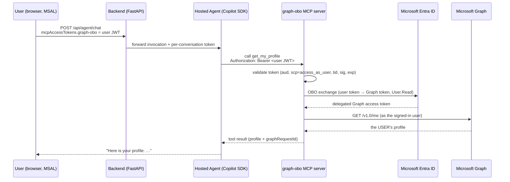

<div align="center">

# Kratos Agent

**Production-ready reference architecture for building extensible AI agents on Azure**

[](https://portal.azure.com)
[](https://github.com/features/copilot)
[](https://ai.azure.com)
[](https://modelcontextprotocol.io)
[](https://python.org)
[](https://nextjs.org)
[](LICENSE)

One-command deploy (`azd up`) provisions Azure services, builds containers, deploys a hosted agent to Microsoft Foundry, and serves a production frontend — all wired with Managed Identity, VNet isolation, and OpenTelemetry tracing. The agent calls Foundry models **directly** (no API Management gateway) and ships an **Entra On-Behalf-Of** MCP server that calls Microsoft Graph as the signed-in user.

</div>

---

## Screenshots

<div align="center">

### Chat Interface
Conversational UI with persona switching, suggested prompts, and live skill indicators.


### Agent Manager — Skills
Configure, toggle, and manage MCP skills per agent persona — no redeploy needed.


### Agent Manager — APM Packages
Install remote skill packages and MCP servers from the curated registry with one click.


### PDF Wealth Report Generation *(example)*
One example of what the agent can produce: the wealth management persona generates branded, multi-page PDF reports with charts — rendered via Playwright and served as downloadable files.


</div>

---

## Architecture

### Why This Architecture — One Agent, N Skills

Instead of orchestrating handoffs between multiple specialized agents, Kratos uses a single agent backed by N swappable MCP skills — simpler to reason about, debug, and extend.

<div align="center">

</div>

### Agentic Loop — Reason, Act, Observe

Each turn follows a Reason → Act → Observe cycle powered by the Copilot SDK. The agent plans its approach, invokes tools, inspects results, and iterates until it has a complete answer.

<div align="center">

</div>

### System Overview

End-to-end request flow from the frontend to the Foundry-hosted agent, which calls models directly and executes skills against platform services.

<div align="center">

</div>

### Dual-Compute Architecture

Kratos runs two compute layers that work together:

| Layer | Runtime | Purpose |
|-------|---------|---------|
| **Hosted Agent** | Microsoft Foundry (auto-scaled, Invocations protocol, port 8088) | Runs the Copilot SDK agentic loop behind an AG-UI adapter, executes skills, calls models |
| **Backend Proxy** | Azure Container Apps (FastAPI, port 8000) | AG-UI relay, conversation persistence, file serving, admin endpoints |
| **Web** | Azure Container Apps (Next.js server, port 3000) | UI on CopilotKit, plus the CopilotKit runtime route that relays AG-UI runs to the backend |

Agent runs travel as [AG-UI](https://docs.ag-ui.com) events end to end: the browser talks to the web app's CopilotKit runtime, which relays each run to the backend, which forwards it to the Foundry hosted agent and streams the events back. Agent session pinning (`x-agent-session-id` header) ensures multi-turn conversations route to the same agent container, preserving in-memory SDK state.

### Core Pillars

| Pillar | Technology | Role |
|--------|------------|------|
| **Engine** | [GitHub Copilot SDK](https://github.com/features/copilot) `1.0.14` | Agentic loop — Plan → Act → Observe → Iterate |
| **Agent UX** | [AG-UI](https://docs.ag-ui.com) + [CopilotKit](https://docs.copilotkit.ai) `1.71` (v2 API) | Streaming chat, live tool cards, human-in-the-loop approvals, run inspector |
| **Platform** | [Microsoft Foundry](https://ai.azure.com) | Hosted agent lifecycle, model hosting, evaluation, guardrails |
| **Extensibility** | [MCP Skills Protocol](https://modelcontextprotocol.io) | Portable, standard tool interface for agent capabilities |
| **Persistence** | [Azure Cosmos DB](https://learn.microsoft.com/azure/cosmos-db/) | Conversations, messages, settings, session mappings |
| **Observability** | [OpenTelemetry](https://opentelemetry.io) + Foundry Traces | End-to-end tracing with GenAI semantic conventions |

---

## Tech Stack

### Backend

| Component | Technology | Version |
|-----------|-----------|---------|
| Language | Python | 3.11 |
| Web framework | FastAPI + uvicorn | ≥0.115 |
| Agent SDK | `github-copilot-sdk` | 1.0.8 |
| Agent runtime | Copilot CLI (`@github/copilot`) | latest |
| Hosted agent protocol | `azure-ai-agentserver-invocations` | ≥1.0.0b3 |
| Database | Azure Cosmos DB (serverless) / SQLite (local) | — |
| Blob storage | Azure Storage / Azurite (local) | — |
| Knowledge retrieval | Bundled synthetic demo documents / optional Azure AI Search | — |
| PDF rendering | Playwright Chromium | — |
| Telemetry | OpenTelemetry + Azure Monitor Exporter | — |
| Package manager | APM CLI (`apm-cli`) | ≥0.5.0 |

### Frontend

| Component | Technology | Version |
|-----------|-----------|---------|
| Framework | Next.js (standalone server) | 15 |
| Agent UX | CopilotKit (`@copilotkit/react-core/v2`, `@copilotkit/runtime/v2`) + AG-UI client | 1.71 / 0.0.59 |
| UI | React + Tailwind CSS | 18 / 3.4 |
| Auth | MSAL (Azure AD) | 3.20 |
| Markdown | react-markdown + remark-gfm | 9.0 / 4.0 |
| Hosting | Azure Container Apps | — |

### Infrastructure (Bicep)

Azure services provisioned via `azd up`:

> VNet · Container Apps Environment · Container Apps (web frontend **+** backend proxy **+** OBO MCP server) · Container Registry · AI Services (Foundry — agent calls models **directly**, no APIM) · Cosmos DB · Blob Storage · Key Vault · App Insights · Log Analytics · Bing Search · Entra OBO app registrations + user-assigned managed identity · RBAC Role Assignments

---

## Quick Start

### Prerequisites

- [Azure Developer CLI (azd)](https://learn.microsoft.com/azure/developer/azure-developer-cli/) **≥1.28** — `azure.yaml` uses `condition:`, which older versions silently ignore
- The `azure.ai.agents` azd extension, at a version compatible with your `azd`. Check with `azd extension list --installed`: an `⚠ Incompatible` status means the hosted agent (`host: azure.ai.agent`) cannot deploy at all. Fix with `azd extension update --all`.

  > Updating a single extension is often not enough: `azure.ai.agents` pins `azure.ai.connections`
  > (`~1.0.0-beta.6` at the time of writing), and installing it against an older
  > `azure.ai.connections` fails with `installed dependency ... does not satisfy constraint`.
  > `azd extension update --all` keeps the set consistent.
- [Azure CLI](https://learn.microsoft.com/cli/azure/) — sign in to **both**: `az login` *and* `azd auth login` (separate token caches)
- [Node.js 20+](https://nodejs.org/)
- [Python 3.11+](https://www.python.org/)
- [Docker](https://www.docker.com/) — **not** required to deploy: all three images set `remoteBuild: true` and build in ACR. Only needed for the local docker-compose stack.

#### Subscription prerequisites (checked automatically)

The Container Apps environment joins a custom VNet, which requires the
`Microsoft.Network/AllowBringYourOwnPublicIpAddress` feature and the
`Microsoft.ContainerService` provider to be registered **on your subscription**. These are
not enabled by default on every subscription, and this is a property of the subscription —
not of your machine or OS.

`hooks/check-azure-prereqs.sh` / `.ps1` runs at `preprovision` and handles this for you:
it checks both, registers whatever is missing, waits for the feature to become active, and
stops **before anything is provisioned** if it takes too long.

Left unchecked, a missing feature surfaces ~15 minutes into `azd up` as a misleading
`A resource with this name already exists or is in a conflicting state` (the real cause,
`SubscriptionNotRegisteredForFeature`, is buried in the ARM deployment details) — and leaves
a half-created Container Apps environment that must be deleted by hand before any retry can
succeed.

```bash
KRATOS_PREREQ_TIMEOUT_MIN=45 azd up   # wait longer than the 15-minute default
KRATOS_SKIP_PREREQ_CHECK=1 azd up     # skip the check entirely
```

If you lack permission to register features (Contributor or Owner is required), the hook
prints the exact commands for an administrator to run.

#### On Windows

`azd up` is supported from **PowerShell 7** (`pwsh`) — every hook ships a `windows:` variant
that runs `hooks/*.ps1`. Two things to know:

- **PowerShell 7 is required**, not Windows PowerShell 5.1. Check with `pwsh --version`.
- **No skills-upload menu.** The POSIX hook prompts for which use-cases to upload to blob
  storage; the Windows one never prompts (it would block the deploy — see
  [hooks/select-use-cases.ps1](hooks/select-use-cases.ps1)). It records "none", which costs
  nothing: the backend seeds the same use-cases from its container image at startup. To
  upload anyway:

  ```powershell
  $env:KRATOS_UPLOAD_USE_CASES = "all"   # or a comma-separated list
  azd up
  # ...or after the fact:
  ./hooks/postdeploy.ps1
  ```

Cloning on Windows requires no special git settings — `.gitattributes` pins `*.sh` to LF, so
the POSIX hooks survive a checkout even with `core.autocrlf=true`.

### Deploy to Azure

```bash
git clone https://github.com/aiappsgbb/kratos-agent && cd kratos-agent
azd up
```

This single command:
1. Provisions all Azure infrastructure via Bicep (VNet, Cosmos DB, AI Services, OBO MCP server, etc.)
2. Builds Docker images for the web frontend, backend and hosted agent
3. Pushes images to Azure Container Registry
4. Deploys the web frontend, the backend and the Entra OBO MCP server to Container Apps
5. Deploys the hosted agent to Microsoft Foundry (via `azd ai agent` extension)
6. Configures all Managed Identity role assignments
7. Outputs the public URL (`AZURE_WEB_APP_URL`)

### Running Multiple Environments

`azd` supports any number of side-by-side environments, so a throwaway experiment never has to share infrastructure with a live deployment. Each one lives in its own directory under `.azure/` (gitignored, so environments stay local and are never committed).

```bash
azd env list                          # show all environments; DEFAULT marks the active one
azd env new <experiment-env>          # create a new one (becomes active immediately)
azd env select <prod-env>             # switch back
azd env get-value AZURE_ENV_NAME      # confirm which one is active right now
```

Environments are fully isolated. `infra/main.bicep` derives its resource token from
`uniqueString(subscription().id, environmentName, location)` and deploys into `rg-<environmentName>`,
so a second environment gets its own resource group and its own uniquely-named resources with no
risk of collision.

> [!WARNING]
> `azd env select` sets a **global** default. `azd up`, `azd deploy`, `azd down` and the
> `e2e-smoke` runner all silently follow whichever environment is active. Confirm with
> `azd env get-value AZURE_ENV_NAME` before deploying or destroying anything, or bypass the
> default entirely by naming the target per command: `azd deploy -e <experiment-env>`.
> `-e` works on `up`, `deploy` and `down`, and is the safer habit once more than one
> environment exists.

The environment name is permanent in practice: it feeds both the resource group name and the
resource-name hash, so renaming one means reprovisioning it from scratch.

Per-environment settings are set with `azd env set` while that environment is active — for example
`azd env set DEPLOY_OBO false` to skip the on-behalf-of stack in an experiment. Values set this way
land in that environment's `.env` only, never in another's.

#### Azure Monitor health model

`infra/` can deploy an Azure Monitor health model (`Microsoft.CloudHealth/healthmodels`, preview) that
models health as advisor (one entity per use case) → tool → downstream-service → Azure resource.

The model is opt-in (`DEPLOY_HEALTH_MODEL=false` by default), because it is a preview,
region-limited resource that needs the `Microsoft.CloudHealth` provider registered first — with
it on by default, every `azd provision` on a subscription without that registration would fail.
Complete the prerequisites below, then enable it:

```bash
azd env set DEPLOY_HEALTH_MODEL true
```

Prerequisites (one-time):

```bash
az provider register -n Microsoft.CloudHealth
az extension add -n health-models
```

Region notes:

- This is a preview resource and region-limited.
- `healthModelLocation` defaults to `centralus`.
- Supported regions are the ones returned by `az provider show -n Microsoft.CloudHealth`.
- `eastus2` is not supported.
- The health model can live in a different region than the monitored resources.

`azd` and ARM deployments are incremental. On a fresh deployment with `DEPLOY_HEALTH_MODEL=false`, no health model is created. If a health model already exists, turning the flag off later does not delete it, and removing entities from topology input does not delete already-deployed entities. Delete the health model resource explicitly (or redeploy fresh) to reconcile.

### Register the Agent in Foundry (One-Time Manual Step)

After `azd up`, register the agent in the Foundry portal so traces appear in the Operate tab:

1. Open [Microsoft Foundry](https://ai.azure.com) → your project → **Operate** → **Agents**
2. Click **+ Register agent** (Custom Agent)
3. Set **Name** to `kratos-agent`, enter the backend Container App URL as the agent endpoint, and `kratos-agent` as the API path
4. Complete the wizard

> **Tip:** `azd env get-values | grep AGENT_SERVICE` shows the backend Container App URL.

This is the only manual step. Traces appear automatically: the deployment connects Application Insights to the Foundry **project**, so the hosted agent emits OpenTelemetry spans that surface in the **Traces** tab (see [Foundry Traces](#foundry-traces)).

### Validating a Deployment

The repo ships a Playwright-based smoke skill at `.copilot/skills/e2e-smoke/` that asserts the **21 critical surfaces** (health, scenarios, chat, evals, traces, UI, regression, interactive UX) of a deployed instance in ~55s. After every deploy:

```bash
cd .copilot/skills/e2e-smoke
./run.sh                 # resolves the target from the selected azd environment
SKIP_BROWSER=1 ./run.sh  # API-only, skips the Chromium download
```

`run.sh` reads `AZURE_WEB_APP_URL` (falling back to `AZURE_STATIC_WEB_APP_URL` on environments provisioned before the web app moved to Container Apps) and `AGENT_SERVICE_URL` from `azd env get-values`, so it always follows whichever environment is currently selected. Override with `KRATOS_FRONTEND_URL` / `KRATOS_BACKEND_URL` to point it elsewhere. It fails fast rather than falling back to a stale default.

See [`.copilot/skills/e2e-smoke/SKILL.md`](./.copilot/skills/e2e-smoke/SKILL.md) for the spec catalogue, env-var reference, and tips for running just the API or just the UX project.
See [`docs/runbooks/post-azd-setup-manual.md`](./docs/runbooks/post-azd-setup-manual.md) for the full post-`azd up` setup and verification checklist.

---

## Local Development

### Full Local Mode (No Azure Required)

Run the entire stack on your laptop with zero Azure dependencies. A GitHub Copilot token replaces Foundry models, SQLite replaces Cosmos DB, and Azurite replaces Blob Storage.

```bash
cp .env.local.example .env.local
# Set COPILOT_GITHUB_TOKEN=ghu_xxx (from github.com/settings/tokens, Copilot scope)
./run-local.sh          # or .\run-local.ps1 on Windows
```

| Service | URL | Notes |
|---------|-----|-------|
| Backend | `http://localhost:8000` | FastAPI + Copilot SDK |
| Azurite | `http://localhost:10000` | Local blob emulator |
| Frontend | `http://localhost:3000` | `cd src/frontend && npm install && npm run dev` |

**Auto-detection:** `LOCAL_MODE` activates whenever `COSMOS_DB_ENDPOINT` is empty. The same codebase runs in both environments without code changes.

**Persistent data:**
- `.local/backend/kratos.db` — SQLite (conversations, messages, settings, sessions)
- `.local/azurite/` — Emulated blob storage (skills, APM manifests)
- `use-cases/` — Bind-mounted; edits on host appear immediately

### Run locally without Docker

`scripts/dev-local.mjs` starts the whole stack as local processes: Azurite, the hosted agent (`:8088`), the backend (`:8000`) and the Next.js frontend with its CopilotKit runtime route (`:3000`).

```bash
# once: Python env for backend + hosted agent, frontend deps, mock MCP servers
cd src/backend && uv sync --extra dev && uv pip install "azure-ai-agentserver-invocations>=1.0.0b3" python-dotenv && cd ../..
cd src/frontend && npm install && cd ../..
cd mocks && npm install --workspaces && npm run build --workspaces --if-present && cd ..

node scripts/dev-local.mjs          # live model: COPILOT_GITHUB_TOKEN from .env.local
node scripts/dev-local.mjs --mock   # deterministic offline model (no login, no cost)
```

`--mock` points the Copilot SDK at a scripted OpenAI-compatible model (`src/frontend/e2e/mock-model.mjs`, built on `@copilotkit/aimock`) through a local-mode-only BYOK override (`OPENAI_BASE_URL`). Everything else is the real stack. The UI shows a **Mock model** badge, and only the scripted prompts work: the capital of France, a demo approval, and loading the email skill.

The runner gives the hosted agent an isolated `COPILOT_HOME`, so your own Copilot CLI config (MCP servers, instructions) does not leak into the agent, and puts the in-repo mock MCP servers on `PATH`, as the container does.

End-to-end tests run the same stack against the mock model:

```bash
cd src/frontend && npx playwright install chromium && npm run test:e2e
```

### Development Against Azure

```bash
# Backend (connects to Azure services via env vars)
cd src/backend
pip install -e ".[dev]"
uvicorn app.main:app --reload --port 8000

# Frontend
cd src/frontend
npm install && npm run dev
```

---

## How It Works

### Request Flow

```
1. User sends a message; CopilotKit posts an AG-UI RunAgentInput (threadId = conversation id,
   forwardedProps = { useCase, mcpAccessTokens }) to the web app's /copilotkit/kratos route
2. The CopilotKit runtime's HttpAgent relays the run to POST /api/agui on the backend
3. Backend looks up the agent session ID for the conversation and forwards the run to the
   Foundry hosted agent via the Invocations REST API (OBO tokens travel out-of-band in the body)
4. Hosted agent runs the Copilot SDK behind the AG-UI adapter (src/backend/app/agui):
   a. One SDK session per thread, built from the use case's system prompt, skills and MCP servers
   b. Call model with tools; execute tool calls (skills, MCP, code interpreter, RAG, ...)
   c. A call to a browser tool (ask_user) suspends: the run ends and waits for the user
   d. Iterate until the model produces a final response
5. AG-UI events stream back through backend and runtime to the browser
6. Backend persists messages and tool calls to Cosmos DB and adds follow-up suggestions
7. The UI renders text, live tool cards, approval cards and the run inspector
```

### Human-in-the-loop approvals

Persona skills gate write actions behind `ask_user`. In the AG-UI path that tool is declared by the browser (`useFrontendTool`), so the SDK runtime suspends the model's call instead of executing it. The UI shows the question inline and in the run inspector. When the user answers, CopilotKit starts a continuation run whose tool message resolves the *original* pending call, and the model carries on in the same turn. The answer is never re-sent as a new prompt. Pending calls live in the hosted agent's process, which session pinning keeps per conversation.

### Event Streaming (AG-UI)

The UI path streams standard [AG-UI events](https://docs.ag-ui.com/concepts/events) over SSE:

| Event | Purpose |
|-------|---------|
| `RUN_STARTED` / `RUN_FINISHED` / `RUN_ERROR` | Run lifecycle |
| `TEXT_MESSAGE_START` / `_CONTENT` / `_END` | Streamed response text |
| `TOOL_CALL_START` / `_ARGS` / `_END` / `_RESULT` | Skill, MCP and built-in tool calls, with arguments and results |
| `REASONING_*` | Model reasoning, when the model emits it |
| `SUBAGENT_*` | Sub-agent lanes, when custom agents are configured |
| `CUSTOM` `kratos.run_stats` | Tokens, time to first token, duration, tool-call count |
| `CUSTOM` `kratos.follow_ups` | Suggested follow-up questions (sent before `RUN_FINISHED`) |

The legacy `POST /api/agent/chat` SSE stream (`thought`, `tool_call`, `content`, `usage`, `done`, `error`) is kept for evals and scripted callers.

### Entra On-Behalf-Of (OBO) — the agent acts as the signed-in user

Most agent tools run as the **agent's own** identity (its managed identity / API
keys). That is the right model for shared resources, but it cannot answer
"what does *Microsoft Graph* return for **me**?" without the agent impersonating
the user — which is exactly what a delegated **On-Behalf-Of** flow is for.

This sample ships a dedicated, Entra-protected MCP server — **`graph-obo`**
(`src/obo-mcp-server/`) — that exposes a `get_my_profile` tool. When the agent
calls it, the tool runs **as the signed-in user**: it performs an Entra OBO token
exchange and calls `GET https://graph.microsoft.com/v1.0/me`, returning the
*user's own* profile (display name, UPN, Entra object id, job title, office,
profile photo, and Graph-only proof fields like `graphRequestId`).

#### The token's journey (user identity, end to end)

```
1. Frontend (MSAL): user signs in; acquireTokenSilent for the OBO API scope
   api://<obo-server-app-id>/access_as_user  →  a delegated USER access token.
2. POST /api/agent/chat carries the token in the body:
   { "message": "...", "mcpAccessTokens": { "graph-obo": "<user JWT>" } }
   (NOT the Authorization header, which carries the app/session auth.)
3. Backend forwards the per-conversation token to the Foundry hosted agent.
4. Hosted agent (CopilotAgent._apply_mcp_tokens) injects it as the
   Authorization: Bearer header ONLY on the matching remote MCP server
   (graph-obo) for THIS conversation — so the model never sees the raw token.
5. graph-obo MCP server validates the inbound user token (audience, scope
   = access_as_user, tenant, signature, expiry), then performs the Entra OBO
   exchange and calls Graph /me AS THE USER.
6. The user's profile flows back as the tool result; the agent summarises it.
```



#### How the MCP server proves its own identity (no secrets in the cloud)

The OBO exchange needs the server to authenticate **itself** to Entra as the
confidential client. In the cloud this is **secret-less**: a **Federated
Identity Credential (FIC)** lets the server's **user-assigned managed identity**
mint the client assertion — no client secret is ever stored. Locally (docker
compose) the same app registration falls back to a `OBO_CLIENT_SECRET` so you
can run the identical flow on your laptop.

| Aspect | Cloud (Container App) | Local (docker compose) |
|--------|----------------------|------------------------|
| Server → Entra auth | FIC → user-assigned managed identity (no secret) | `OBO_CLIENT_SECRET` (dev only) |
| Inbound token validation | identical (aud / `access_as_user` / tenant / sig / exp) | identical |
| Graph call | `GET /me` as the user, `User.Read` | same |

#### Why it is safe (the guardrails that matter)

> **Important:** the raw user token is treated as a secret. It is injected as the
> `Authorization` header **only** on the `graph-obo` MCP server, **only** for the
> conversation it belongs to, and is **stripped from anything the model sees** —
> the model receives `hasProfilePhoto: true`, never the token or photo bytes.

- **Confused-deputy guard:** `ALLOWED_CLIENT_APP_IDS` restricts which client app
  may act on the user's behalf — a token minted by a different app is rejected.
- **Audience/scope pinning:** the server only accepts tokens whose audience is
  its own API and whose scope contains `access_as_user`.
- **Least privilege:** the Graph token is scoped to `User.Read` only.

#### Try it

After deploying (or running the local stack), sign in with the
**"Sign in (On-Behalf-Of)"** button, then ask:

```
Use the graph-obo tool to look me up and report my displayName,
userPrincipalName, id, jobTitle and officeLocation.
```

The agent calls `graph-obo-get_my_profile` and reports **your** Graph profile —
proof the tool ran with your delegated identity, not the agent's.

See [`src/obo-mcp-server/`](src/obo-mcp-server/) (`obo.py`, `server.py`) for the
validation + exchange, and `CopilotAgent._apply_mcp_tokens` in
[`src/backend/app/services/copilot_agent.py`](src/backend/app/services/copilot_agent.py)
for the per-conversation header injection.

### Session Pinning

Multi-turn conversations require routing to the same hosted agent container to preserve in-memory SDK state:

1. First invocation → Foundry returns `x-agent-session-id` response header
2. Backend stores the mapping in Cosmos DB (`sessions` container, partitioned by `conversationId`)
3. Subsequent messages → Backend appends `?agent_session_id=<id>` to the Invocations URL
4. Foundry routes to the same container instance

### Copilot SDK Integration

The UI path serves the SDK through an AG-UI adapter vendored from the [AG-UI Copilot SDK integration](https://github.com/ag-ui-protocol/ag-ui/pull/2981) (`src/backend/app/agui/`, MIT; swap for the published package once it ships). `KratosAGUIAgent` supplies the Kratos parts: the use case's tools, skills, MCP servers with OBO bearers, system prompt and model provider, plus session resume and run statistics.

The `CopilotAgent` class wraps the GitHub Copilot SDK:

```python
from copilot import CopilotClient
from copilot.tools import define_tool

# Agent manages sessions per conversation
client = CopilotClient(...)
async for event in client.run(message=msg, session_id=conv_id):
    # Translate SDK events → SSE events (content, thoughts, tool_calls, usage)
```

- **Auth:** `ChainedTokenCredential` (ManagedIdentity → AzureCLI) with `get_bearer_token_provider` for keyless model access
- **Multi-use-case:** Each use case gets its own `SkillRegistry` and system prompt; selected per conversation
- **Session resume:** SDK sessions are keyed by `conversation_id`; agent session pinning ensures the same container handles all turns

---

## Use Cases

Kratos ships with four configurable agent personas, each with its own system prompt, skills, and APM manifest:

| Use Case | Directory | Description |
|----------|-----------|-------------|
| **Generic** | `use-cases/generic/` | General-purpose assistant with web search, code interpreter, file sharing |
| **Retail Banking** | `use-cases/retail-banking/` | Account lookup, transaction history, mortgage calculator, spending analysis |
| **Wealth Management** | `use-cases/wealth-management/` | Portfolio review, tax analysis, PDF wealth reports with charts |
| **Insurance** | `use-cases/insurance/` | Policy information, claims processing, coverage analysis |
| **Sales Account Review** | `use-cases/sales-account-review/` | AE/CSM co-pilot — account briefings, pipeline review, at-risk signals against the in-repo `salesforce-mcp-server` mock |
| **HR Onboarding** | `use-cases/hr-onboarding/` | People-team co-pilot — drafts pre-hire records, briefs managers on their teams, approves PTO with explicit user confirmation on every write, against the in-repo `workday-mcp-server` mock |
| **IT Service Desk L1** | `use-cases/it-service-desk/` | L1 support co-pilot — triages tickets, searches the KB, surfaces VIP queues, and resolves/reassigns tickets with explicit user confirmation on every write, against the in-repo `servicenow-mcp-server` mock |
| **Clinician Visit Prep** | `use-cases/clinician-visit-prep/` | Outpatient-clinic co-pilot — daily schedule briefings, pre-visit summaries with derived clinical focus, lab trends, and med-problem reconciliation against the in-repo `epic-fhir-mcp-server` mock (FHIR R4 resources) |

The insurance demo includes a small synthetic policy corpus under
`use-cases/insurance/knowledge-base/`, so its policy-wording prompts work
immediately after `azd up` without provisioning a paid search service. The
`rag_search` tool uses Azure AI Search instead when `AZURE_AI_SEARCH_ENDPOINT`
is configured, preserving the bring-your-own knowledge-base path.

Each use case has:
- `SYSTEM_PROMPT.md` — Agent persona and behavior instructions
- `skills/` — Domain-specific MCP skills (SKILL.md files)
- `apm.yml` + `apm.lock.yaml` — Remote skill dependencies

Switch use cases per conversation via the frontend dropdown or `useCase` field in the API request.

### Export a use case as a standalone Foundry Hosted Agent

Each persona can be downloaded as a self-contained ZIP that ships everything
needed to deploy the *same* agent into a different Azure subscription as a
[Microsoft Foundry Hosted Agent](https://learn.microsoft.com/azure/ai-foundry/agents/):

* `copilot-instructions.md` — the persona's system prompt
* `skills/` — every SKILL.md and supporting script/asset
* `mcp-config.json` — the persona's MCP server map
* `mocks/packages/` — referenced local stdio mock servers, ready for `npm install -g`
* `main.py` — a ~300-LoC single-tenant runtime (Copilot SDK + Foundry `InvocationAgentServerHost`)
* `Dockerfile`, `pyproject.toml`, `agent.yaml`, `azure.yaml`, `infra/` (Bicep)

Trigger from the UI ("Download as Foundry Agent" under the persona picker)
or directly via the API:

```bash
curl -OJ http://localhost:8000/api/use-cases/finance-close/export
# → finance-close-foundry-agent.zip

unzip finance-close-foundry-agent.zip && cd finance-close-agent
azd auth login && azd env new my-finance-close && azd up
```

The exported agent surfaces in the target Foundry project alongside any
other hosted agents — no Kratos backend required at runtime.

---

## Skills & MCP Protocol

Skills extend the agent's capabilities using the [Model Context Protocol](https://modelcontextprotocol.io). Each skill is a directory with a `SKILL.md` file containing YAML frontmatter and natural-language instructions.

### Skill Format

```yaml
---
name: account-lookup
description: Retrieves customer account information
enabled: true
---

## Instructions
When the user asks about their account balance or account details...

## Supported Parameters
- account_id: The customer's account identifier

## Example
User: "What's my account balance?"
→ Call account_lookup with the user's account ID
```

### Skill Loading Architecture

Skills load from three sources in priority order:

1. **Blob Storage** (primary) — `use-cases/{use-case}/skills/{name}/SKILL.md`
2. **Local filesystem** (fallback) — Same path, read directly from disk
3. **APM packages** (supplementary) — Materialised into `.github/skills/` by `apm install`

Local/blob skills always win on name conflict with APM packages.

### Adding a Custom Skill

1. Create `use-cases/{use-case}/skills/my-skill/SKILL.md`
2. Upload to blob storage via the admin API: `POST /api/admin/skills?use_case={use-case}`
3. The skill is available immediately — no redeploy needed

### MCP Servers

External MCP servers (e.g., `faker-mcp-server`) are configured per use case via `use-cases/{use-case}/.mcp.json` and managed through the admin API at `/api/admin/mcp-servers?use_case={use-case}`.

---

## APM — Agent Package Manager

[APM](https://microsoft.github.io/apm/) is a dependency manager for agent primitives — skills, prompts, MCP servers, and plugins. Think `package.json` for agents.

Each use case has a manifest at `use-cases/{name}/apm.yml`:

```yaml
name: kratos-generic
version: 1.0.0
target: copilot
dependencies:
  apm:
    - microsoft/apm-sample-package#v1.0.0
    - anthropics/skills/skills/frontend-design
  mcp: []
```

### Runtime Management

```bash
# Install a remote plugin (no redeploy needed)
curl -X POST https://<agent>/api/admin/use-cases/generic/apm/install \
  -H "Content-Type: application/json" \
  -d '{"package": "anthropics/skills/skills/frontend-design"}'

# Sync all dependencies from manifest
curl -X POST https://<agent>/api/admin/use-cases/generic/apm/sync
```

| Method | Endpoint | Purpose |
|--------|----------|---------|
| `GET` | `/api/admin/use-cases/{uc}/apm` | List dependencies + lockfile |
| `POST` | `/api/admin/use-cases/{uc}/apm/install` | Install a package |
| `DELETE` | `/api/admin/use-cases/{uc}/apm/{package}` | Uninstall a package |
| `POST` | `/api/admin/use-cases/{uc}/apm/sync` | Full resync from manifest |
| `POST` | `/api/admin/use-cases/{uc}/apm/update` | Update lockfile to latest refs |

### Security

`apm install` runs a content audit (hidden Unicode detection, known-bad package hashes) before materialising files. Diagnostics are surfaced in the admin API response.

---

## File Sharing

The agent can create files (CSVs, PDFs, charts, code) and share them with users via download links.

### How It Works

1. **Skill instructions** guide the agent to write files to `/tmp` and reference the path in the response
2. **Hosted agent** detects `/tmp/` file paths in the response, reads the files, and streams them as base64-encoded `file_content` SSE events
3. **Backend proxy** intercepts these events, decodes the base64 content, and saves files to its own `/tmp`
4. **Frontend** detects `/tmp/` paths in markdown and rewrites them as download links pointing to `GET /api/files/download/{filename}?path=/tmp/{filename}`

This SSE streaming approach solves the cross-container file sharing problem — the hosted agent (Foundry-managed, outside VNet) cannot directly access the storage account (private endpoint only), so files are streamed through the existing SSE channel instead.

---

## Observability

### OpenTelemetry

Full-stack instrumentation following [GenAI semantic conventions](https://opentelemetry.io/docs/specs/semconv/gen-ai/):

| Layer | Instrumentation |
|-------|----------------|
| HTTP | `FastAPIInstrumentor` — request/response tracing |
| Models | `OpenAIInstrumentor` (openai-v2) — LLM call tracing |
| Agent | Custom spans for `invoke_agent`, `execute_tool` |
| Logs | Python logging bridge → OTel Logs → App Insights |

**Exporters:** `AzureMonitorTraceExporter`, `AzureMonitorMetricExporter`, `AzureMonitorLogExporter`

**Custom metrics:**
- `gen_ai.client.token.usage` — histogram for input/output token counts
- `gen_ai.client.operation.duration` — histogram for operation latency

### Foundry Traces

Traces come from the application's **OpenTelemetry** instrumentation exporting to Application Insights — **not** from any gateway. The Foundry **Traces** tab lights up because the deployment connects the Application Insights resource to the Foundry **project** (an `appinsights` project connection provisioned in `infra/modules/ai-services.bicep`). Once connected, Foundry injects the App Insights connection string into the hosted-agent sandbox and reads the spans back, displaying end-to-end agent execution traces including:

- User messages and agent responses
- Tool/skill invocations with inputs and outputs
- Token consumption per model call
- Latency breakdown (time-to-first-token, model latency, total duration)

### Frontend Execution Details

The UI is built headless on CopilotKit hooks, styled with the Kratos themes:

- **Tool cards** — every skill, MCP and built-in call renders live (`useRenderTool` wildcard), labelled by kind, expandable to its input and result
- **Approval cards** — `ask_user` questions with choices or a free-text answer, inline and mirrored in the run inspector
- **Run inspector** — run status, a timed activity timeline (tools, decisions, sub-agents), last-run tokens and latency, and the persona's skills
- **Per-turn stats** — duration, time to first token, tokens and tool calls under each answer
- **History** — conversations reload from Cosmos with their tool cards and answered decisions

---

## Evals & Tracing

Per-use-case evaluation harness and an App-Insights waterfall trace inspector — both surfaced as admin tabs in the UI and exposed via CLI for CI.

### Per-Use-Case Eval Scenarios

Each use-case carries its own eval suite under `use-cases/<name>/evals/`:

```
use-cases/insurance/evals/
  eval_config.json          ← evaluator list + judge model
  scenarios/                ← committed JSON scenarios
    load-customer-profile.json
    policy-wording-lookup.json
    ...
  results/                  ← run output (gitignored)
```

Each scenario declares an `input_message`, `expected_behavior`, `expected_tool_calls`, and the Foundry evaluator set to apply (e.g. `Relevance`, `Coherence`, `TaskAdherence`, `IntentResolution`, `ToolCallAccuracy`).

### Two Eval Modes

| Mode | Pattern | Speed | Use |
|------|---------|-------|-----|
| **validation** | In-process: invoke agent sequentially → score locally with `azure-ai-evaluation` evaluators | Seconds | Fast feedback loop, CI smoke |
| **foundry** | Full Foundry eval pipeline (same evaluators, hosted scoring) | Minutes | Pre-release runs, shareable Foundry portal links |

Both modes follow the **two-phase invoke + score** pattern from the `foundry-evals` awesome-gbb skill: Phase 1 invokes the hosted agent via `AIProjectClient(...).get_openai_client(agent_name=...)` with a warmup retry loop for cold starts; Phase 2 scores the recorded turns with the evaluators configured in `eval_config.json`.

### LLM-Generated Scenarios

The "Generate Scenarios" modal (or `POST /api/use-cases/{uc}/evals/scenarios/generate`) reads the use-case `SYSTEM_PROMPT.md` and the loaded skill catalog and asks the judge model to draft realistic conversations that exercise the agent. Each draft is hand-reviewable before commit. Industry-realism canons from `threadlight-demo-data-factory` are injected for FSI-shaped use-cases (`insurance`, `retail-banking`, `wealth-management`) so generated data feels plausible.

### Traces Panel

The "Traces" admin tab queries App Insights via `LogsQueryClient` (resource-scoped) and renders a per-operation waterfall classified into `llm / agent / tool / skill / http / platform / error` spans. Filterable by `use_case`, `conversation_id`, `run_id`, and lookback window. Identical UX to `threadlight-vnext`.

Spans carry three custom attributes for the filter:

- `kratos.use_case`
- `kratos.conversation_id`
- `kratos.eval_run_id` (only set during eval runs)

These are stamped in `copilot_agent.py` and forwarded to the hosted agent via `x-kratos-*` headers from `foundry_agent_proxy.py`.

### CLI

For CI / scripting:

```bash
# Generate (and optionally save) scenarios
BACKEND_URL=https://kratos-be.example.com \
  python scripts/generate_evals.py --use-case insurance --count 5 --save

# Run validation evals
python scripts/run_evals.py --use-case insurance --mode validation

# Run hosted Foundry evals
python scripts/run_evals.py --use-case insurance --mode foundry

# Inspect traces
python scripts/fetch_traces.py --conversation-id abc123
```

> **API JSON convention.** The backend API uses **camelCase** field names (Pydantic
> alias generator) — `/api/agent/chat` expects `{message, useCase, conversationId}`,
> not snake_case. The on-disk eval-scenario format is the exception: it uses
> `input_message`, `expected_behavior`, `expected_tool_calls` (snake_case) so
> scenarios stay readable in version control. The `.copilot/skills/e2e-smoke/`
> Playwright skill encodes both conventions if you want a runnable reference.

---

## Security

| Control | Implementation |
|---------|---------------|
| **Zero secrets in code** | All secrets in Key Vault, accessed via Managed Identity |
| **Passwordless auth** | `ChainedTokenCredential` (ManagedIdentity → AzureCLI) for all service-to-service |
| **Network isolation** | VNet with private endpoints for Cosmos DB, Key Vault, Blob Storage |
| **Identity** | Least-privilege RBAC role assignments per service identity |
| **Content safety** | Foundry guardrails (prompt shields, jailbreak detection) |
| **File serving** | Path traversal protection, MIME type allowlisting, safe filename validation |
| **Frontend auth** | MSAL (Microsoft Entra ID) with `@azure/msal-react` |
| **Delegated access (OBO)** | Agent acts as the signed-in user via Entra On-Behalf-Of: per-conversation user token injected only on the `graph-obo` MCP server, stripped from model context; secret-less FIC→managed-identity client assertion in the cloud; `access_as_user` + `ALLOWED_CLIENT_APP_IDS` confused-deputy guard |

---

## Project Structure

```
kratos-agent/
├── azure.yaml                      # azd config: 4 services (agent-service, hosted-agent, obo-mcp-server, web)
├── docker-compose.yml              # Local dev: backend + hosted-agent + obo-mcp-server + azurite
├── AGENTS.md                       # Working agreements for AI agents (public-repo rules, validation)
│
├── .github/
│   ├── workflows/
│   │   ├── ci-cd.yml               # CI only: lint, test, build. Does NOT deploy.
│   │   └── deploy.yml              # Manual (workflow_dispatch) deploy to staging/production
│   └── dependabot.yml              # Grouped security + minor/patch updates for pip and npm
│
├── infra/                          # Bicep IaC (18 modules)
│   ├── main.bicep
│   └── modules/
│       ├── network.bicep           # VNet + subnets + private endpoints
│       ├── agent-service.bicep     # Container App (backend proxy)
│       ├── ai-services.bicep       # AI Services (Foundry account + project + App Insights connection)
│       ├── obo-mcp-server.bicep    # Container App — Entra-protected OBO MCP server (graph-obo)
│       ├── obo-entra-app.bicep     # Entra app registrations for the OBO API (server + client)
│       ├── obo-identity.bicep      # User-assigned MI + federated credential (secret-less OBO)
│       ├── cosmos-db.bicep         # Cosmos DB serverless (4 containers)
│       ├── blob-storage.bicep      # Storage Account (skills, APM)
│       ├── container-apps-env.bicep
│       ├── container-registry.bicep
│       ├── static-web-app.bicep
│       ├── key-vault.bicep
│       ├── app-insights.bicep
│       ├── log-analytics.bicep
│       ├── bing-search.bicep
│       └── role-assignments.bicep  # All RBAC assignments
│
├── src/
│   ├── backend/                    # Python agent service (FastAPI)
│   │   ├── Dockerfile              # python:3.11-slim + Node.js 20 + Playwright
│   │   ├── pyproject.toml
│   │   └── app/
│   │       ├── main.py             # FastAPI entry point (port 8000)
│   │       ├── config.py           # Settings + LOCAL_MODE auto-detection
│   │       ├── models.py           # Pydantic event schemas
│   │       ├── observability.py    # OpenTelemetry setup
│   │       ├── routers/
│   │       │   ├── agent.py        # POST /api/agent/chat — SSE proxy to hosted agent
│   │       │   ├── conversations.py
│   │       │   ├── files.py        # GET /api/files/download/{filename}
│   │       │   ├── settings.py
│   │       │   ├── use_cases.py
│   │       │   ├── copilot_studio.py  # Copilot Studio / Teams bridge
│   │       │   ├── admin_skills.py
│   │       │   ├── admin_prompt.py
│   │       │   ├── admin_apm.py
│   │       │   ├── admin_mcp.py
│   │       │   └── admin_analysis.py  # Use-case consistency analysis
│   │       └── services/
│   │           ├── copilot_agent.py       # CopilotClient wrapper + agentic loop
│   │           ├── cosmos_service.py      # Cosmos DB / SQLite persistence
│   │           ├── skill_registry.py      # Per-use-case skill loading
│   │           ├── skill_tools.py         # @define_tool implementations
│   │           ├── blob_skill_service.py  # Blob CRUD for skills
│   │           ├── foundry_agent_proxy.py # Invocations REST API client
│   │           ├── apm_service.py         # APM CLI wrapper
│   │           ├── ai_search_tools.py     # AI Search index management
│   │           └── follow_up_service.py   # Follow-up question generation
│   │
│   ├── hosted-agent/               # Foundry hosted agent
│   │   ├── Dockerfile              # python:3.11-slim + same tooling as backend
│   │   ├── main.py                 # InvocationAgentServerHost (port 8088)
│   │   ├── agent.yaml              # Foundry agent manifest
│   │   └── pyproject.toml
│   │
│   └── frontend/                   # Next.js 15 server: UI + CopilotKit runtime
│       ├── e2e/                    # Playwright specs + scripted mock model
│       └── src/
│           ├── app/                # Pages, /copilotkit/[agent] runtime route, /config.json
│           ├── components/agent/   # AgentWorkspace, MessageList, ToolCallChip, AskUserCard, RunInspector
│           ├── lib/                # API client, config, AG-UI helpers
│           └── types/              # TypeScript types
│
├── use-cases/                      # Agent personas
│   ├── generic/                    # General-purpose assistant
│   ├── retail-banking/             # Banking agent
│   ├── wealth-management/          # Wealth advisor
│   └── insurance/                  # Insurance agent
│
└── hooks/
    ├── assign-agent-roles.sh       # Grants the hosted agent its data-plane roles
    ├── grant-obo-consent.sh        # Admin-consents the OBO app's Graph permission
    ├── postdeploy.sh               # Uploads the selected skills after deploy
    └── select-use-cases.sh         # Asks which skills to upload (runs first)
```

---

## API Reference

### Agent

| Method | Endpoint | Description |
|--------|----------|-------------|
| `POST` | `/api/agui` | Run the agent over AG-UI (`RunAgentInput` in, AG-UI events out); used by the UI |
| `POST` | `/api/agent/chat` | Legacy SSE stream, kept for evals and scripted callers |
| `POST` | `/api/agent/user-input` | Legacy; returns 501 in hosted mode (the AG-UI path answers `ask_user` in the browser) |

### Conversations

| Method | Endpoint | Description |
|--------|----------|-------------|
| `GET` | `/api/conversations` | List conversations |
| `POST` | `/api/conversations` | Create conversation |
| `GET` | `/api/conversations/{id}` | Get conversation + messages |
| `PATCH` | `/api/conversations/{id}` | Update conversation |
| `DELETE` | `/api/conversations/{id}` | Delete conversation |

### Files

| Method | Endpoint | Description |
|--------|----------|-------------|
| `GET` | `/api/files/download/{filename}` | Download agent-created file |

### Admin

| Method | Endpoint | Description |
|--------|----------|-------------|
| `GET/POST` | `/api/admin/skills?use_case=` | List / create skills |
| `GET/PATCH/DELETE` | `/api/admin/skills/{skill_name}` | Read, update, delete a skill |
| `GET` | `/api/admin/skills/{skill_name}/files` | List a skill's files |
| `PUT/DELETE` | `/api/admin/skills/{skill_name}/files/{file_path}` | Write / delete a skill file |
| `GET/PUT/DELETE` | `/api/admin/system-prompt?use_case=` | System prompt management |
| `GET/PUT` | `/api/admin/mcp-servers?use_case=` | MCP server configuration |
| `GET/POST/DELETE` | `/api/admin/use-cases/{use_case}/apm/*` | APM dependency management |
| `POST` | `/api/admin/analysis/consistency` | Use-case consistency analysis |
| `POST` | `/api/admin/analysis/apply-fix` | Apply a suggested consistency fix |

> `use_case` is a **query** parameter on the skills, system-prompt, and
> mcp-servers routes — it is not a path segment.

### Copilot Studio

| Method | Endpoint | Description |
|--------|----------|-------------|
| `POST` | `/api/copilot-studio/chat` | Synchronous endpoint for Teams/M365 |

### System

| Method | Endpoint | Description |
|--------|----------|-------------|
| `GET` | `/health` | Health check |
| `GET` | `/api/settings` | Service configuration status |
| `GET` | `/api/use-cases` | List available use cases |
| `GET` | `/api/use-cases/{use_case}/export` | Download use-case as Foundry Hosted Agent ZIP |

---

## Infrastructure

### Cosmos DB Data Model

| Container | Partition Key | Purpose |
|-----------|--------------|---------|
| `conversations` | `/userId` | Conversation metadata |
| `messages` | `/conversationId` | Chat messages + tool call metadata |
| `settings` | `/category` | System prompt, configuration |
| `sessions` | `/conversationId` | Agent session ID ↔ conversation mappings |

### Network Topology

```
VNet
├── container-apps-subnet      # Container Apps Environment (backend + OBO MCP server)
└── private-endpoints-subnet   # Private endpoints for:
                                  - Cosmos DB
                                  - Key Vault
                                  - Blob Storage
```

### Identity & RBAC

All service-to-service auth uses Managed Identity with least-privilege roles:

| Identity | Role | Scope |
|----------|------|-------|
| Container App | Cosmos DB Data Contributor | Cosmos DB account |
| Container App | Storage Blob Data Contributor | Storage account |
| Container App | Key Vault Secrets User | Key Vault |
| AI Services | Storage Blob Data Contributor | Storage account |
| Web Container App | AcrPull | Container Registry (user-assigned identity) |

---

## Cost Baseline

| Service | Monthly Estimate |
|---------|-----------------|
| Container Apps (consumption) | $0 – $50 |
| Cosmos DB (serverless) | $5 – $25 |
| Key Vault | ~$1 |
| Container Registry (Basic) | ~$5 |
| Application Insights | $5 – $20 |
| Foundry Models (per-token) | Variable |
| **Total baseline** | **~$90 – $175/month** |

> Model costs (GPT-4o, GPT-5) are usage-dependent and not included in the baseline.
> Removing the API Management gateway (the agent now calls Foundry directly) cuts ~$175/month off the previous baseline.

---

## Troubleshooting

Real findings from deploying this repo end-to-end on a fresh Azure subscription. Add to this list as you hit new ones.

### Postdeploy 404 "false alarm" at the tail of every `azd deploy`

**Symptom:** A scary RED block at the tail of every `azd deploy <any-service>` reporting `agents/<key>/versions/<n>` not found, even though the deploy succeeded.

**Cause:** The `azure.ai.agents` azd extension's postdeploy hook fires after **every** `azd deploy` (including unrelated services like `web`) and looks up `agents/<service-key>/versions/<n>` using the SERVICE KEY from `azure.yaml` verbatim, not the agent name.

**Fix in this repo:** `azure.yaml` uses `services.kratos-agent` (matches the agent name in `src/hosted-agent/agent.yaml`). If you fork and rename, keep them aligned.

### `create_version` deduplication — new image, but old code still runs

**Symptom:** You `azd deploy kratos-agent`, the build succeeds, but the running agent serves the previous behaviour. `azd ai agent show` reports a new version but its image digest is identical.

**Cause:** Foundry deduplicates `create_version` when environment variables and metadata are identical — even if the container image tag differs. The `_BUILD_TS` env var in `src/hosted-agent/agent.yaml` (sourced from `KRATOS_BUILD_TS`) is what makes each version unique.

**Fix in this repo:** A `predeploy` hook on `services.kratos-agent` in `azure.yaml` auto-bumps `KRATOS_BUILD_TS` to the current unix timestamp before every deploy. **You shouldn't need to do anything manually.** If you bypass the hook, run `azd env set KRATOS_BUILD_TS $(date +%s)` first.

### Hosted-agent uses `invocations`, not `responses`

**Symptom:** Direct calls to `oai.responses.create()` against the hosted agent return HTTP 400 `invalid_request_error`.

**Cause:** `src/hosted-agent/agent.yaml` declares `protocol: invocations` (not `responses`). Use `AIProjectClient(...).get_openai_client(agent_name="kratos-agent")` — the SDK picks the right transport based on the agent's declared protocol.

This is wired correctly in `src/backend/app/services/eval_service.py` and in the e2e-smoke chat helper. If you write a new client, mirror the invocations pattern.

### 4-identity AcrPull / Foundry User dance on a fresh deploy

**Symptom:** On a brand-new resource group, the hosted agent returns `server_error` on first call. `az role assignment list` shows correct grants on the account-level MI, but the agent's own instance/blueprint identities are missing roles.

**Cause:** Foundry hosted agents have **four** identity surfaces that all need RBAC:
1. The Foundry project MI (system-assigned on the account)
2. The deployer/CI MI (Contributor + `User Access Administrator` on the Foundry account)
3. The **instance** identity (per-agent runtime SP — created at first deploy)
4. The **blueprint** identity (per-agent platform SP — created at first deploy)

The `azd ai agent` postdeploy hook auto-assigns `Foundry User` (GUID `53ca6127-db72-4b80-b1b0-d745d6d5456d`) to (3) and (4) **if** the deployer has `Azure AI Project Manager` on the project. Confirm with `azd ai agent show` — the `instance_identity.principal_id` and `blueprint.principal_id` should appear in `az role assignment list --assignee <principal_id> --all`.

If empty, grant manually:
```bash
ACCT="/subscriptions/<sub>/resourceGroups/<rg>/providers/Microsoft.CognitiveServices/accounts/<account>"
PROJ="$ACCT/projects/<project>"
FOUNDRY_USER=53ca6127-db72-4b80-b1b0-d745d6d5456d
for PID in <instance_pid> <blueprint_pid> <project_mi_pid>; do
  az role assignment create --assignee "$PID" --role "$FOUNDRY_USER" --scope "$ACCT"
  az role assignment create --assignee "$PID" --role "$FOUNDRY_USER" --scope "$PROJ"
  az role assignment create --assignee "$PID" --role AcrPull \
    --scope "/subscriptions/<sub>/resourceGroups/<rg>/providers/Microsoft.ContainerRegistry/registries/<acr>"
done
```

RBAC propagation takes 5–15 min. Re-run the e2e-smoke skill to confirm.

### `Authorization_RequestDenied` on the OBO Entra app

Only relevant when `DEPLOY_OBO=true`.

The OBO server app needs delegated Microsoft Graph `User.Read`. *Requesting*
that permission is declarative and needs no special rights — it is part of the
app registration in `infra/modules/obo-entra-app.bicep`. *Granting* it is a
separate, privileged operation: a tenant-wide consent (`AllPrincipals`) on
behalf of every user in the directory.

Granting requires an **Entra ID directory role** — Global Administrator,
Privileged Role Administrator, or Cloud Application Administrator. Azure RBAC
does not include it, so being subscription **Owner** is not enough. This trips
people up because every other part of the deploy is pure Azure RBAC.

The consent therefore lives in `hooks/grant-obo-consent.sh` at postprovision
rather than in Bicep: Bicep cannot continue past a forbidden resource, so a
consent it was not allowed to make failed the entire provision with a bare
`Authorization_RequestDenied` and no clue that the cause was a directory role.
The hook attempts the grant, and if it is refused it says so and lets the
deployment finish.

**Nothing is broken if the grant is skipped.** OBO still works — the first user
to sign in is asked to consent to `User.Read` themselves. To grant it once,
an administrator runs:

```bash
az ad app permission admin-consent --id "$(azd env get-value OBO_SERVER_APP_CLIENT_ID)"
```

...or opens the app registration in the portal → **API permissions** →
**Grant admin consent**.

### Choosing which skills get uploaded

`azd up` asks, right at the start, which use-cases to upload to blob storage.
The answer is recorded and acted on after the deploy finishes.

**Why it is asked up front:** `azd` paints a live progress table for the whole
run and repaints over anything a hook prints. Asking at upload time meant the
menu lost its last options and the prompt itself, so you were answering a
question you could not see. `hooks/select-use-cases.sh` runs before that table
starts; `hooks/postdeploy.sh` then uploads without prompting.

A deploy will never stop and wait for you at the end: `azd` invokes the hook
with `--from-deploy`, which disables prompting entirely. If no answer was
recorded, it says so and uploads nothing rather than asking.

Press Enter to skip — nothing is uploaded unless you ask for it.

To choose without being prompted:

```bash
KRATOS_UPLOAD_USE_CASES=all azd up                      # every use-case
KRATOS_UPLOAD_USE_CASES=retail-banking,insurance azd up # just these
KRATOS_UPLOAD_USE_CASES=none azd up                     # skip
```

To upload later, without redeploying, run the hook directly — that gives you
the same menu, with nothing painting over it:

```bash
./hooks/postdeploy.sh
```

With no terminal at all (CI, `--no-prompt`, a piped shell) the upload is
skipped rather than guessed at. The older `KRATOS_AUTO_UPLOAD_USE_CASES=1` is
still honoured and means "all".

> The skills storage account is provisioned with `publicNetworkAccess: Disabled`, so the upload only works from inside the VNet or from an allow-listed IP. Setting the flag on a GitHub-hosted runner will fail — which is why CI leaves it unset and the deploy workflow exposes it as an opt-in input.

---

## License

MIT
